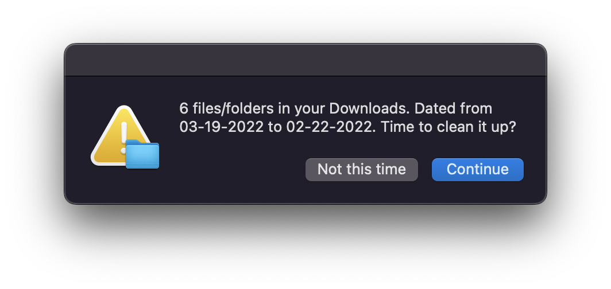

# Download folder checker

Simple script to check Downloads folder on MacOS for existing files.
Can be used as reminder to keep files organized and Downloads folder empty.

Bash script checkFolder.sh iterates through all files in Download folder.\
The result of the script is a message with Number of files and folders and a date range from date of creation.\
Execution example:\
`$ ./checkFolder.sh`\
`6 files/folders in your Downloads. Dated from 03-19-2022 to 02-22-2022. Time to clean it up?`

Apple script dialog.scpt opens dialog with the message from checkFolder.sh script.\
`Change the Full path in dialog.scpt before executing`\
`$ osascript dialog.scpt `

**Continue** will open Downloads folder in Finder.

To have it running on a schedule:\
`adjust Full path and StartCalendarInterval`\
`$ cp com.my.checkDownloads.plist ~/Library/LaunchAgents/`\
`$ launchctl load ~/Library/LaunchAgents/com.my.checkDownloads.plist`

